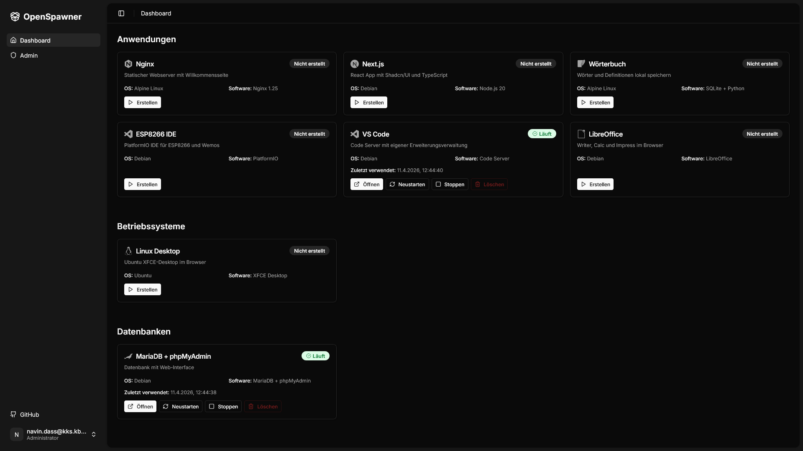

# OpenSpawner

> Self-hosted service that spawns isolated Docker containers per user. Passwordless magic-link auth, per-user subdomains, and a multi-template catalog.




## Table of contents

- [Features](#features)
- [Architecture](#architecture)
- [Prerequisites](#prerequisites)
- [Quick start](#quick-start)
- [First login](#first-login)
- [Configuration](#configuration)
- [Templates](#templates)
- [Production deployment](#production-deployment)
- [Project structure](#project-structure)
- [Troubleshooting](#troubleshooting)
- [License & Authors](#license--authors)

## Features

- Passwordless login via magic links (no password, no OAuth provider)
- Per-user Docker container spawned from a catalog of templates
- Built-in catalog: VS Code, Next.js, MariaDB, PlatformIO, LibreOffice, full Linux desktop, and more
- JWT auth via `HttpOnly` cookie; each container validates independently
- Automatic idle shutdown and stale cleanup (user volumes preserved)
- Production-ready with Traefik reverse proxy and Let's Encrypt

## Architecture

```
Browser
  │
  ├─► Frontend (Next.js)     :3000
  │     │
  │     └─► /api/* proxy
  │             │
  ├─► Backend (Flask API)    :5000
  │     │
  │     └─► Docker Engine
  │             │
  │             ├─► User Container A
  │             ├─► User Container B
  │             └─► ...
```

| Layer | Stack |
|---|---|
| Backend | Flask, SQLAlchemy, JWT, Docker SDK |
| Frontend | Next.js 14, TypeScript, Tailwind CSS, Radix UI |
| Database | SQLite (default) |
| Auth | Passwordless magic links + JWT cookie |

## Prerequisites

Everything runs in containers. You only need Docker on the host.

| OS | Install |
|---|---|
| macOS | [Docker Desktop for Mac](https://docs.docker.com/desktop/install/mac-install/) |
| Windows | [Docker Desktop for Windows](https://docs.docker.com/desktop/install/windows-install/) (WSL2 backend required) |
| Linux | [Docker Engine](https://docs.docker.com/engine/install/) + [Compose plugin](https://docs.docker.com/compose/install/linux/) |
| Server (headless) | Same as Linux. SSH-only setups work; no X server needed |

**Minimum versions:** Docker ≥ 20.10, Docker Compose ≥ v2.0. Git is required to clone. Python and Node are **not** needed on the host.

## Quick start

Works identically on macOS, Linux, Windows (WSL2 / PowerShell / Git Bash), and headless servers.

```bash
# 1. Clone and enter the repo
git clone https://github.com/otlz/OpenSpawner.git
cd OpenSpawner

# 2. Create your .env from the template
cp .env.example .env
```

### Minimal setup

Builds only the default templates (Nginx, PlatformIO IDE, MariaDB). Fastest way to get started.

```bash
docker compose --profile default build
docker compose up -d
```

### Full setup

Builds all available templates from the catalog.

```bash
docker compose --profile build build
docker compose up -d
```

Then open [http://localhost:3000](http://localhost:3000). API health check: [http://localhost:5000/health](http://localhost:5000/health).

> **Shortcut for Linux/macOS:** `bash install.sh` runs the same sequence with version checks and auto-creates the Docker `web` network.

### Adding templates later

After the initial setup, you can build additional templates at any time. They appear on the user dashboard automatically.

```bash
# Build a single template
docker compose build template-office

# Build multiple templates at once
docker compose build template-vscode template-linuxmint

# Build all remaining templates
docker compose --profile build build
```

No restart needed. The dashboard only shows templates whose images are available locally.

## First login

1. Open [http://localhost:3000](http://localhost:3000) and enter your email.
2. SMTP is not configured by default. Grab the magic link from the backend logs:
   ```bash
   docker compose logs -f spawner | grep -i magic
   ```
3. Paste the link into your browser. **The first user to register automatically becomes admin.**

## Configuration

All settings live in `.env` (template: `.env.example`). The six variables that matter for the first run:

| Variable | Default | Purpose |
|---|---|---|
| `SECRET_KEY` | `dev-secret-...` | Flask session secret (**change in production**) |
| `BASE_DOMAIN` | `localhost` | Your domain (e.g. `example.com`) |
| `SPAWNER_SUBDOMAIN` | `coder` | Produces `coder.example.com` |
| `TRAEFIK_ENABLED` | `false` | Set to `true` for production |
| `USER_TEMPLATE_IMAGES` | (from templates.json) | Fallback if `templates.json` is missing; semicolon-separated image list |
| `DEFAULT_MEMORY_LIMIT` | `512m` | RAM limit per user container |

Generate a production `SECRET_KEY`:

```bash
python3 -c "import secrets; print(secrets.token_hex(32))"
```

Full configuration reference: [`.env.example`](.env.example).

## Templates

OpenSpawner ships with a catalog of ready-to-run container templates, organized by category.

**Applications**

| Template | Description |
|---|---|
| `template-nginx` | Static web server with welcome page |
| `template-nextjs` | React app with Shadcn/UI and TypeScript |
| `template-dictionary` | Store words and definitions locally |
| `template-vcoder` | PlatformIO IDE for ESP8266 and Wemos |
| `template-vscode` | Code Server with extension management |
| `template-office` | Writer, Calc, and Impress in the browser |

**Operating systems**

| Template | Description |
|---|---|
| `template-linuxmint` | Ubuntu XFCE desktop in the browser |

**Databases**

| Template | Description |
|---|---|
| `template-mariadb` | MariaDB with phpMyAdmin web interface |

### Adding your own template

1. Create `templates/<category>/template-xyz/` with a `Dockerfile` (must expose port **8080**).
2. Add a build service to `docker-compose.yml` (under the `build` profile).
3. Add metadata (display name, description, category, icon) to `templates.json`.
4. Build: `docker compose build template-xyz`.

See `templates.json` for the full metadata schema.

## Production deployment

Production uses Traefik for routing, HTTPS, and per-user subdomains. You need a running Traefik instance with the Docker provider enabled and a certificate resolver (e.g. Let's Encrypt). See [traefik.io](https://traefik.io/) for setup.

```bash
# 1. Ensure the shared 'web' network exists (create it if Traefik hasn't)
docker network create web

# 2. In .env, set:
#    BASE_DOMAIN=your-domain.com
#    TRAEFIK_ENABLED=true
#    TRAEFIK_NETWORK=web
#    TRAEFIK_CERTRESOLVER=lets-encrypt
#    TRAEFIK_ENTRYPOINT=websecure

# 3. Start with the production compose file
docker compose -f docker-compose.prod.yml up -d --build
```

## Project structure

```
OpenSpawner/
├── app/                     # Flask backend (routes, services, models)
│   ├── routes/              # api.py, admin.py, auth.py
│   └── services/            # container_manager, reaper, email_service
├── frontend/                # Next.js 14 + TypeScript + Tailwind
├── templates/               # User container templates (software/, os/, database/)
├── docs/                    # Architecture, guides, security notes
├── config.py                # Env var loader
├── run.py                   # Flask entry point
├── docker-compose.yml       # Local development
├── docker-compose.prod.yml  # Production (Traefik)
├── install.sh               # One-shot installer (Linux/macOS)
├── templates.json           # Template metadata (names, icons, limits)
└── .env.example             # Configuration reference
```

## Troubleshooting

- **Port 3000 or 5000 already in use** → stop the other process, or change `SPAWNER_PORT` in `.env`.
- **Magic link email never arrives** → expected without SMTP; grab it from `docker compose logs spawner | grep magic`.
- **`network web not found` on `docker-compose.prod.yml`** → run `docker network create web`.
- **User container returns 403** → JWT cookie missing or expired; log out and back in.
- **`template-nextjs` build looks stuck** → it runs `npm install` + build inside the container; allow 2–5 minutes on the first build.

## License & Authors

Licensed under the MIT License. See [LICENSE](LICENSE).

- **Rainer Wieland**, Karl Kübel Schule Bensheim
- **Navin Dass**, Karl Kübel Schule Bensheim
